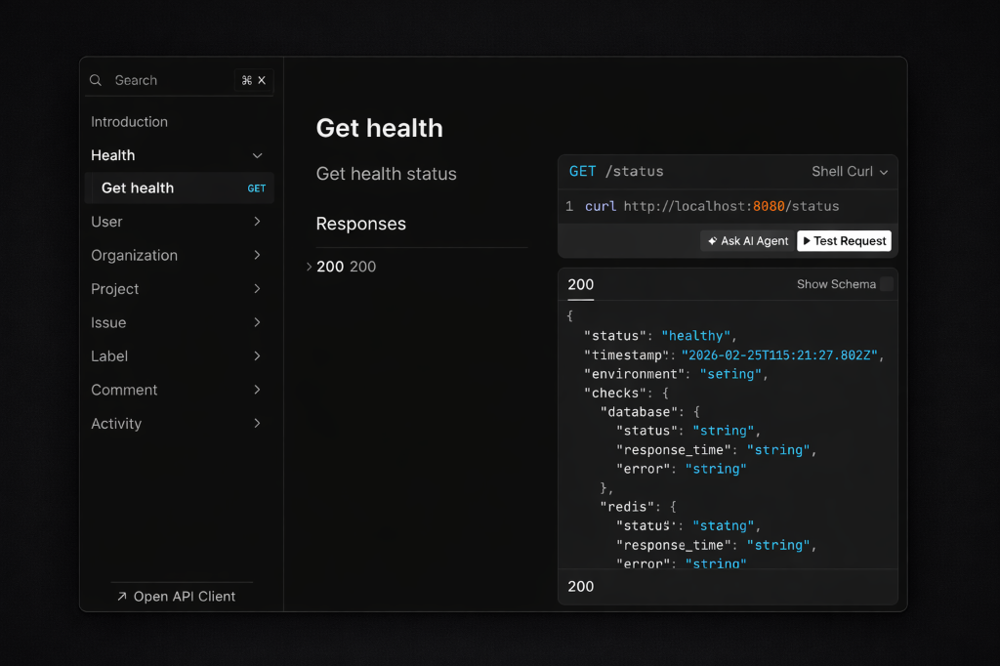

<div align="center">

# 🚀 Vector

**A modern, production-ready project management API built with Go.**

[](https://go.dev)
[](https://www.postgresql.org)
[](https://redis.io)
[](https://docs.docker.com/compose)
[](LICENSE)

[Features](#-features) • [Architecture](#-architecture) • [Tech Stack](#-tech-stack) • [Quick Start](#-quick-start) • [API Reference](#-api-reference) • [Contributing](#-contributing)

</div>

---

## 📖 Overview

**Vector** is a full-featured project management and issue tracking backend, designed with clean architecture principles. It supports multi-tenant organizations, project management, issue tracking with labels, commenting, and a real-time activity feed — all powered by an event-driven architecture.

Built as a monorepo with a Go backend and shared TypeScript packages for API contracts, validation, and email templates.

---

## ✨ Features

### Core Functionality
- **Organizations** — Multi-tenant workspaces with role-based member management and subscription tiers
- **Projects** — Organize work under organizations with dedicated project members
- **Issues** — Full issue lifecycle management with status tracking
- **Labels** — Customizable labels with color coding, assignable to issues
- **Comments** — Threaded comments on issues for team collaboration
- **Activity Feed** — Automatic tracking of all changes across projects, issues, and comments

### Platform Capabilities
- **Authentication** — Clerk-powered auth with webhook sync for user/org provisioning
- **Event-Driven Architecture** — Pub/Sub event bus (backed by Redis + Asynq) for decoupled activity tracking
- **Background Jobs** — Scheduled and async task processing via Asynq (e.g., activity cleanup)
- **Email Notifications** — Transactional emails via Resend with HTML templates
- **Observability** — New Relic APM with distributed tracing, structured logging (zerolog), and health checks
- **Rate Limiting** — Configurable per-route rate limiting
- **OpenAPI Contracts** — Auto-generated TypeScript clients from OpenAPI spec
- **Validation** — Shared Zod schemas for frontend/backend contract alignment
- **Database Migrations** — Version-controlled SQL migrations via Tern
- **Integration Testing** — Real database tests using Testcontainers

---

## 🏗 Architecture

```
┌─────────────────────────────────────────────────────────────────────┐
│                          Client (Frontend)                          │
└──────────────────────────────┬──────────────────────────────────────┘
                               │ HTTP/REST
                               ▼
┌─────────────────────────────────────────────────────────────────────┐
│                         Echo HTTP Server                            │
│  ┌──────────┐  ┌──────────┐  ┌─────────────┐  ┌────────────────┐   │
│  │   Auth   │  │  CORS /  │  │  Request ID │  │  Rate Limiter  │   │
│  │Middleware│  │ Logging  │  │  / Tracing  │  │                │   │
│  └──────────┘  └──────────┘  └─────────────┘  └────────────────┘   │
└──────────────────────────────┬──────────────────────────────────────┘
                               │
                               ▼
┌─────────────────────────────────────────────────────────────────────┐
│                          Handler Layer                              │
│  Validates requests, calls services, returns HTTP responses         │
└──────────────────────────────┬──────────────────────────────────────┘
                               │
                               ▼
┌─────────────────────────────────────────────────────────────────────┐
│                          Service Layer                              │
│  Business logic, authorization, orchestration                       │
│  ┌──────────────────────────────────────────────────────┐           │
│  │  Users · Orgs · Projects · Issues · Labels · Comments│           │
│  └──────────────────────────────────────────────────────┘           │
└───────────────┬──────────────────────────────┬──────────────────────┘
                │                              │
                ▼                              ▼
┌──────────────────────────┐    ┌──────────────────────────────────┐
│    Repository Layer      │    │       Event Bus (Pub/Sub)        │
│  Database queries via    │    │  Publishes domain events for     │
│  DBTX interface (pgx)   │    │  activity tracking & side effects│
└───────────┬──────────────┘    └───────────────┬──────────────────┘
            │                                   │
            ▼                                   ▼
┌──────────────────────┐         ┌──────────────────────────────────┐
│   PostgreSQL 16      │         │   Redis 7 + Asynq Workers       │
│   (Primary Store)    │         │   (Queue, Cache, Jobs)           │
└──────────────────────┘         └──────────────────────────────────┘
```

### Layered Architecture

| Layer          | Responsibility                                                 |
|----------------|----------------------------------------------------------------|
| **Router**     | Route registration and grouping                                |
| **Middleware** | Auth, CORS, logging, tracing, rate limiting, request context   |
| **Handler**    | HTTP request parsing, validation, response formatting          |
| **Service**    | Business logic, authorization, event publishing                |
| **Repository** | Database access via `DBTX` interface for transaction support   |
| **Events**     | Domain event definitions, pub/sub bus, activity subscribers    |
| **Model**      | Domain types: User, Organization, Project, Issue, Label, etc.  |

---

## 🛠 Tech Stack

### Backend

| Technology                                          | Purpose                          |
|-----------------------------------------------------|----------------------------------|
| [Go 1.24](https://go.dev)                           | Primary language                 |
| [Echo v4](https://echo.labstack.com)                | HTTP framework                   |
| [pgx v5](https://github.com/jackc/pgx)             | PostgreSQL driver & connection pool |
| [Tern](https://github.com/jackc/tern)               | Database migrations              |
| [Redis](https://redis.io) + [go-redis](https://github.com/redis/go-redis) | Caching & message broker |
| [Asynq](https://github.com/hibiken/asynq)           | Background job processing        |
| [Clerk](https://clerk.com)                           | Authentication & user management |
| [zerolog](https://github.com/rs/zerolog)             | Structured logging               |
| [New Relic](https://newrelic.com)                    | APM, distributed tracing, log forwarding |
| [Resend](https://resend.com)                         | Transactional emails             |
| [validator/v10](https://github.com/go-playground/validator) | Request validation          |
| [koanf](https://github.com/knadh/koanf)             | Configuration management         |
| [Testcontainers](https://testcontainers.com)         | Integration testing              |

### Frontend Packages (TypeScript)

| Package             | Purpose                                         |
|---------------------|--------------------------------------------------|
| `@vector/openapi`   | TypeScript API contracts generated from OpenAPI   |
| `@vector/zod`       | Zod validation schemas for shared contracts       |
| `@vector/emails`    | Email templates for transactional emails          |

### Infrastructure

| Tool                                      | Purpose                  |
|-------------------------------------------|--------------------------|
| [Docker Compose](https://docs.docker.com/compose/) | Local development environment |
| [Turborepo](https://turbo.build)          | Monorepo build system    |
| [Bun](https://bun.sh)                     | JavaScript runtime & package manager |
| [Task](https://taskfile.dev)              | Go task runner           |
| [golangci-lint](https://golangci-lint.run) | Go linting              |

---

## ⚡ Quick Start

### Prerequisites

| Tool            | Version    | Install                                                     |
|-----------------|------------|--------------------------------------------------------------|
| **Docker**      | Latest     | [docker.com](https://docs.docker.com/get-docker/)            |
| **Go**          | ≥ 1.24     | [go.dev](https://go.dev/dl/)                                 |
| **Bun**         | ≥ 1.3.4    | [bun.sh](https://bun.sh)                                     |
| **Node.js**     | ≥ 18       | [nodejs.org](https://nodejs.org)                              |
| **Task**        | Latest     | `brew install go-task` or [taskfile.dev](https://taskfile.dev)|
| **golangci-lint**| Latest    | `brew install golangci-lint`                                  |

### Option 1: Docker Compose (Recommended)

The fastest way to get everything running:

```bash
# Clone the repository
git clone https://github.com/RahulSingh9131/vector.git
cd vector

# Start all services (PostgreSQL, Redis, Backend)
docker-compose up --build
```

The API will be available at **http://localhost:8080**.

### Option 2: Local Development

For active development with hot reloading:

**1. Start infrastructure services:**
```bash
# Start PostgreSQL and Redis only
docker-compose up postgres redis
```

**2. Set up the backend:**
```bash
cd backend

# Copy environment config
cp .env.sample .env
# Edit .env with your local settings (database password, API keys, etc.)

# Install Go dependencies
go mod download

# Run database migrations
task migrations:up

# Start the backend server
task run
```

**3. Set up frontend packages:**
```bash
# From the project root
bun install
bun run build
```

### Verify Setup

```bash
# Health check
curl http://localhost:8080/api/v1/health

# Expected response
{
  "status": "healthy",
  "checks": {
    "database": "up",
    "redis": "up"
  }
}
```

---

## 📁 Project Structure

```
vector/
├── backend/                    # Go backend application
│   ├── cmd/vector/             # Application entrypoint
│   ├── internal/
│   │   ├── config/             # Configuration (koanf-based)
│   │   ├── ctxutil/            # Context utilities
│   │   ├── database/           # Database connection & migrations
│   │   ├── errs/               # Application error types
│   │   ├── events/             # Event bus, publishers, subscribers
│   │   ├── handler/            # HTTP handlers (request/response)
│   │   ├── lib/                # Shared libraries
│   │   │   ├── email/          # Email service (Resend)
│   │   │   ├── job/            # Background job service (Asynq)
│   │   │   └── utils/          # General utilities
│   │   ├── logger/             # Structured logging (zerolog + New Relic)
│   │   ├── middleware/         # HTTP middleware stack
│   │   ├── model/              # Domain models
│   │   ├── repository/         # Data access layer
│   │   ├── router/             # Route definitions
│   │   ├── server/             # Server initialization
│   │   ├── service/            # Business logic layer
│   │   ├── sqlerr/             # SQL error mapping
│   │   ├── testing/            # Integration test helpers
│   │   └── validation/         # Request validation
│   ├── static/                 # Static assets
│   ├── templates/              # Email/HTML templates
│   ├── Dockerfile              # Multi-stage Docker build
│   ├── Taskfile.yml            # Backend task runner
│   └── .golangci.yml           # Linter configuration
│
├── packages/                   # Shared TypeScript packages
│   ├── openapi/                # API contracts from OpenAPI spec
│   ├── zod/                    # Validation schemas
│   └── emails/                 # Email templates
│
├── docker-compose.yml          # Local dev infrastructure
├── turbo.json                  # Turborepo configuration
├── package.json                # Root workspace config
├── CONTRIBUTING.md             # Contribution guidelines
└── LICENSE                     # MIT License
```

---

## 📡 API Documentation

Vector ships with **interactive API documentation** powered by [Scalar](https://scalar.com), available at:

```
http://localhost:8080/docs
```

<div align="center">



<br />
<em>Interactive API explorer with request builder, code examples, and response schemas.</em>

</div>

The documentation covers all available endpoints across **Health**, **Users**, **Organizations**, **Projects**, **Issues**, **Labels**, **Comments**, and **Activity** resources — complete with request/response schemas, authentication requirements, and try-it-out capabilities.

> The full OpenAPI specification is also available at [`openapi.json`](openapi.json).

---

## 🧪 Development

### Available Commands

#### Backend (via [Taskfile](https://taskfile.dev))

```bash
cd backend

task run               # Run the application
task lint              # Run golangci-lint
task lint:fix          # Auto-fix lint issues
task tidy              # Format code & tidy modules
task migrations:new name=xxx  # Create a new migration
task migrations:up     # Apply pending migrations
task help              # List all available tasks
```

#### Monorepo (via [Turborepo](https://turbo.build))

```bash
bun run dev            # Start dev mode for all packages
bun run build          # Build all packages
bun run lint           # Lint all packages
bun run test           # Run tests across all packages
bun run type-check     # TypeScript type checking
bun run format         # Format code
bun run clean          # Clean build artifacts
bun run turbo:clean    # Deep clean (cache + node_modules)
```

### Environment Variables

The backend is configured via environment variables with the `VECTOR_` prefix. See [`.env.sample`](backend/.env.sample) for all available options:

| Category         | Key Variables                                                    |
|------------------|------------------------------------------------------------------|
| **Server**       | `PORT`, `READ_TIMEOUT`, `WRITE_TIMEOUT`, `CORS_ALLOWED_ORIGINS` |
| **Database**     | `HOST`, `PORT`, `USER`, `PASSWORD`, `NAME`, `SSL_MODE`          |
| **Auth**         | `SECRET_KEY` (Clerk)                                             |
| **Redis**        | `ADDRESS`                                                        |
| **Integrations** | `RESEND_API_KEY`                                                 |
| **Observability**| `NEW_RELIC.*`, `LOGGING.*`, `HEALTH_CHECKS.*`                    |

---

## 🤝 Contributing

Contributions are welcome! Please read our [Contributing Guide](CONTRIBUTING.md) for details on:

- Development workflow
- Commit conventions
- Pull request process
- Coding standards

---

## 📄 License

This project is licensed under the **MIT License** — see the [LICENSE](LICENSE) file for details.

---

<div align="center">

**Built with ❤️ by [Rahul Singh](https://github.com/RahulSingh9131)**

</div>
